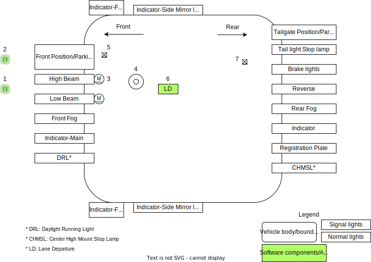

# **Vehicle Lighting System**

- [**Vehicle Lighting System**](#vehicle-lighting-system)
  - [Introduction](#introduction)
  - [Terms, Definitions, Abbreviations](#terms-definitions-abbreviations)
    - [Requirements](#requirements)
  - [External Light System](#external-light-system)
    - [Purpose](#purpose)
    - [External lights and controls](#external-lights-and-controls)
  - [References](#references)

## Introduction
A vehicle has lighting to illuminate the road and surroundings ahead to increase visibility for driver to see presence of obstacles, pedestrians, path of travel. Additionally, vehicle has lights to signal, warn, alert drivers of other vehicles and pedestrians of direction of the vehicle, seek priority of movement from other vehicles and other indications such as stop. A vehicle has lights placed outside the vehicle (external lights) and lights inside vehicle (internal lights). This document provides details of all the lights of a vehicle and details of how each of these lights are controlled.

## Terms, Definitions, Abbreviations

| Term | Description |
|------|-------------|
| EMI  | Electro Magnetic Interference |

### Requirements

Following are the requirements of lights in an automobile

* Reduction of EMI
* Need to operate in cold and hot temperatures
* Durability

 

## External Light System

### Purpose

* Ensure safety in road traffic and conditions
* Illuminate the lane and enables driver to recognize the road, obstacles and traffic signs
* Road users and others to perceive the presence of vehicle
* Road users and others to recognize intention of driver

### External lights and controls

|  |
| :------------------------------------: |
|                 *XYZ*                  |

## References
1. [Automotive Exterior Lighting by Synopsys](https://www.synopsys.com/automotive/what-is-automotive-exterior-lighting.html)
2. [Power Supplies for Next-Generation Automotive Lighting by Analog Devices](https://www.analog.com/en/technical-articles/power-supplies-for-nextgeneration-automotive-lighting.html)