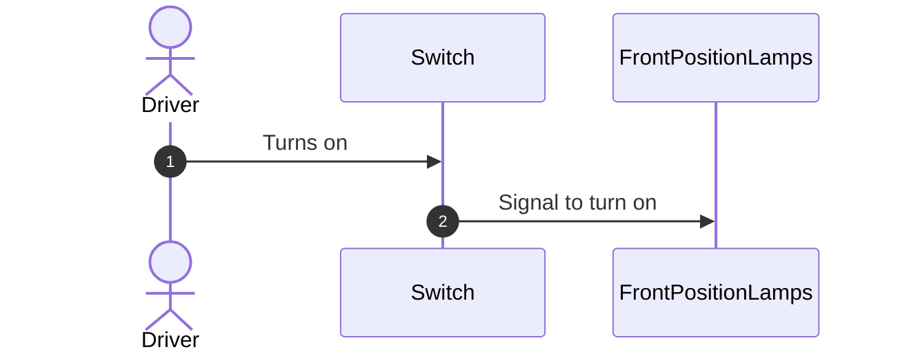
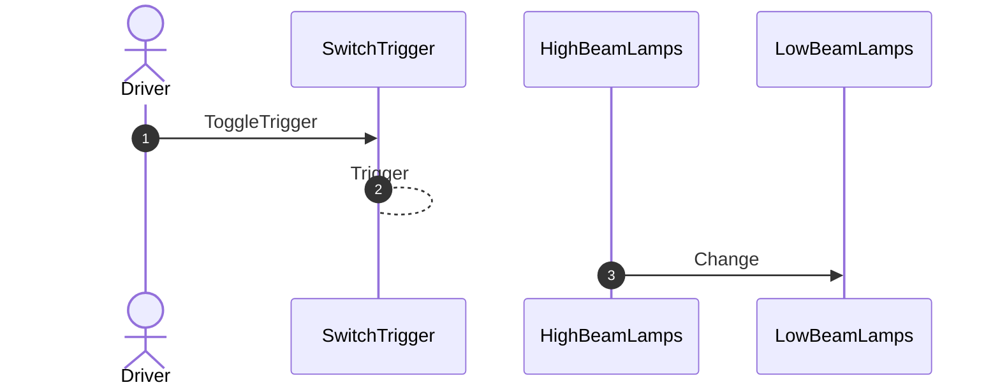
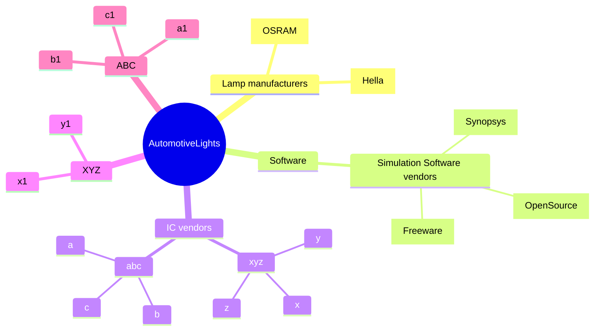

# **Vehicle Lighting System**

- [**Vehicle Lighting System**](#vehicle-lighting-system)
  - [Introduction](#introduction)
  - [Terms, Definitions, Abbreviations](#terms-definitions-abbreviations)
    - [Requirements](#requirements)
  - [External Light System](#external-light-system)
    - [Purpose](#purpose)
    - [External lights and controls](#external-lights-and-controls)
      - [Front Position/Parking Lamp and Tailgate Position/Parking Lamp](#front-positionparking-lamp-and-tailgate-positionparking-lamp)
      - [Indicator - side mirror and Fender lamps](#indicator---side-mirror-and-fender-lamps)
      - [High Beam, Low Beam Lamps](#high-beam-low-beam-lamps)
        - [Adaptive Front Light system (AFS)](#adaptive-front-light-system-afs)
      - [Fog - Front, Rear](#fog---front-rear)
      - [Brake lights](#brake-lights)
      - [Daylight Running lights (DRL)](#daylight-running-lights-drl)
      - [Center High Mount Stop Lamp (CHMSL)](#center-high-mount-stop-lamp-chmsl)
  - [Hardware and Software for Vehicle Lighting system](#hardware-and-software-for-vehicle-lighting-system)
    - [Software](#software)
  - [Automotive Lighting: Ecosystem](#automotive-lighting-ecosystem)
  - [References](#references)

## Introduction
A vehicle has lighting to illuminate the road and surroundings ahead to increase visibility for driver to see presence of obstacles, pedestrians, path of travel. Additionally, vehicle has lights to signal, warn, alert drivers of other vehicles and pedestrians of direction of the vehicle, seek priority of movement from other vehicles and other indications such as stop. Lighting system is very important in a vehicle from the perspective of safety of occupants of vehicle and road users and infrastructure. A vehicle has lights placed outside the vehicle (external lights) and lights inside vehicle (internal lights). This document provides details of all the lights of a vehicle and details of how each of these lights are controlled.

## Terms, Definitions, Abbreviations

| Term | Description |
|------|-------------|
| EMI  | Electro Magnetic Interference |
| DRL  | Daylight Running Light |
| CHMSL | Center High Mount Stop Lamp |
| LD | Lane Departure |
| AFS | Adaptive Frontlight System |

### Requirements

Following are the requirements of lights in an automobile

* Reduction of EMI
* Need to operate in cold and hot temperatures
* Durability
* Optimal energy consumption
* Regulations

 

## External Light System

### Purpose

* Ensure safety in road traffic and conditions
* Illuminate the lane and enables driver to recognize the road, obstacles and traffic signs
* Road users and others to perceive the presence of vehicle
* Road users and others to recognize intention of driver

### External lights and controls

|  |
| :------------------------------------: |
|                 *External Lights in a Vehicle*                  |

#### Front Position/Parking Lamp and Tailgate Position/Parking Lamp
These lamps/lights are also called side lights. These lights are used to increase visibility of the vehicle when it is parked.

These lights are triggered using a switch shown as (5) in the diagram.

Parking lamps are connected through simple physical electrical wiring and a switch. This is shown in the diagram below.

|  |
| :------------------------------------: |
|                 *Parking Lights Wiring*                  |

#### Indicator - side mirror and Fender lamps
Side mirror and Fender lamps are triggered by the following

Hardware: Turn signal lever is activated to indicate direction - left or Right
Software Triggered: When lane departure is detected on the left side or right side

These lamps are deactivated when turn signal lever is brought to normal position or lane transition completion is detected

#### High Beam, Low Beam Lamps
High beam lamps are of low intensity and illuminate a shorter distance in front of the vehicle. Low beam lamps are of high intensity and illuminate greater distance.

Switching between high and low beam is by manual trigger by the driver.

##### Adaptive Front Light system (AFS)
<TBD>

#### Fog - Front, Rear

#### Brake lights

#### Daylight Running lights (DRL)

#### Center High Mount Stop Lamp (CHMSL)

## Hardware and Software for Vehicle Lighting system

### Software

| Product Name | Vendor/Open Source | Purpose | Description |
|--------------|--------------------|---------|-------------|
| Lucidshape | Synopsis | Simulate and Evaluate automotive headlamps  | Night driving simulation software Based on CATIA CAD tool |

## Automotive Lighting: Ecosystem

## References
1. [Automotive Exterior Lighting by Synopsys](https://www.synopsys.com/automotive/what-is-automotive-exterior-lighting.html)
2. [Power Supplies for Next-Generation Automotive Lighting by Analog Devices](https://www.analog.com/en/technical-articles/power-supplies-for-nextgeneration-automotive-lighting.html)